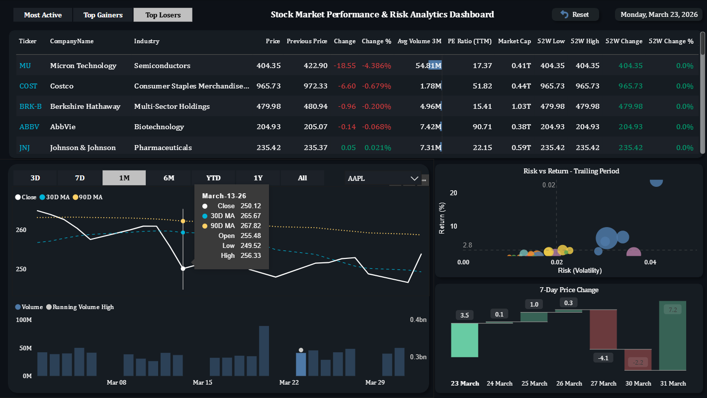
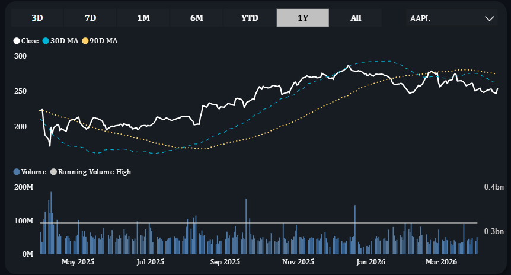
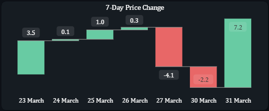
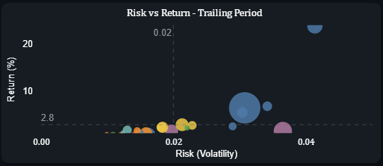

# 📈 MarketPulse: An Automated S&P 500 Market Intelligence Dashboard

> **A Yahoo Finance–style stock market dashboard built with Python and Power BI,
> featuring a fully automated daily data pipeline powered by GitHub Actions.**

---

## 📌 Table of Contents

- [🎬 Demo](#-demo)
- [🌟 Why I Built This](#-why-i-built-this)
- [📸 Screenshots](#-screenshots)
- [🎯 Skills Demonstrated](#-skills-demonstrated)
- [⚙️ How It Works](#️-how-it-works)
- [🚀 Features](#-features)
- [🛠️ Tech Stack](#️-tech-stack)
- [📐 Data Model](#-data-model)
- [🧮 Key DAX Measures](#-key-dax-measures)
- [🧠 Key Learnings & Challenges](#-key-learnings--challenges)
- [⚠️ Limitations](#️-limitations)
- [🔮 Future Enhancements](#-future-enhancements)
- [📁 Repository Structure](#-repository-structure)
- [🔄 Automated Pipeline Setup](#-automated-pipeline-setup)
- [🏃 How to Run Locally](#-how-to-run-locally)
- [📊 Data Sources](#-data-sources)
- [👤 Author](#-author)
- [📄 License](#-license)

---

## 🎬 Demo

[](https://github.com/NK-Mikey/Stock-Market-Dashboard/raw/main/demo/marketpulse_demo.mp4)

> ▶️ *Click the video thumbnail above to download and watch a full walkthrough of the dashboard including
> live filtering, visual interactions, scatter plot analysis and date range switching.*

---

## 🌟 Why I Built This

Most stock dashboards either require expensive data subscriptions or only show
static snapshots. I wanted to build something that:

- **Looks and feels like a real financial terminal** - not a student project
- **Data gets updated automatically every day** without any manual intervention
- **Tells a complete market story** from individual stock performance down
  to sector-level risk and return analysis
- **Uses only free tools** like Python, Power BI Desktop, GitHub Actions

The result is **MarketPulse**, a fully automated market intelligence dashboard
that tracks the **Top 25 S&P 500 companies** by market capitalization, refreshed
daily with zero manual effort.

---

## 📸 Screenshots

| Price & Volume Analysis |
|---|
|  |

| 7-Day Price Change | Risk vs Return |
|---|---|
|  |  |

---

## 🎯 Skills Demonstrated

| Category | Skills |
|---|---|
| **Data Engineering** | ETL pipeline, API integration, automated scheduling |
| **Data Modeling** | Star schema, DAX, calculated columns vs measures |
| **Visualization** | Financial dashboard design, conditional formatting, waterfall analysis |
| **Python** | pandas, yfinance, requests, data transformation |
| **Tools** | Power BI Desktop, GitHub Actions, Git |
| **Finance Domain** | Market cap, PE ratio, moving averages, volatility |

---

## ⚙️ How It Works

```
┌─────────────────────────────────────────────────────┐
│                  EVERY DAY AT 6AM UTC               │
│                                                     │
│   GitHub Actions                                    │
│        │                                            │
│        ▼                                            │
│   Python Script (fetch_top25_sp500.py)              │
│        │                                            │
│        ├── Fetches Top 25 S&P 500 by Market Cap     │
│        ├── Downloads daily OHLCV price history      │
│        ├── Fetches fundamentals (PE, Market Cap)    │
│        │                                            │
│        ▼                                            │
│   Updated CSVs committed back to GitHub             │
│        │                                            │
│        ▼                                            │
│   Power BI Desktop reads latest CSVs                │
│   → One click refresh → Dashboard updates           │
└─────────────────────────────────────────────────────┘
```

---

## 🚀 Features

### 📊 Stock Screener Table
A Yahoo Finance–style master table showing all 25 tickers with:

| Metric | Description |
|---|---|
| Price | Latest closing price |
| Change / Change % | Daily price movement with green/red conditional formatting |
| Volume | Daily trading volume |
| Avg Volume (3M) | 3-month average volume with data bars |
| Market Cap | Total market capitalization |
| PE Ratio (TTM) | Trailing twelve months price-to-earnings ratio |
| 52W High / Low | 52-week price range |
| 52W Change % | Year-over-year performance |

Includes **Top Gainers / Top Losers / Most Active** sorting - switchable
with one click using a tile slicer.

---

### 📉 Price Trend Chart with Moving Averages
A multi-layer line chart showing:
- **Current Price** - white line, primary focus
- **30-Day Moving Average** - blue, short-term trend
- **90-Day Moving Average** - orange, long-term trend

Paired with a **date range slicer** (3D / 7D / 1M / 6M / YTD / 1Y / All)
that dynamically adjusts both charts simultaneously.

---

### 📦 Volume Analysis Chart
A combo chart tracking:
- **Daily Volume** - column bars showing actual trading activity
- **Running Volume High** - line showing the cumulative peak volume,
  persisting forward until a new high is reached

This instantly flags unusual trading activity, a spike above the running
high signals institutional interest or major market events.

---

### 🎯 Risk vs Return Scatter Plot
Each of the 25 tickers plotted as a bubble where:
- **X-axis** = Volatility (standard deviation of daily returns)
- **Y-axis** = Total Return % of last 3 years
- **Bubble size** = Trading volume of last 3 years
- **Bubble color** = Sector (Technology, Healthcare, Financials etc.)

A reference line splits the chart at average volatility by instantly showing
which stocks delivered the best return for the least risk. This is the kind
of analysis used in portfolio management and risk assessment.

---

### 📊 7-Day Price Change Analysis
A waterfall chart showing the cumulative price movement over the last 7 days:
- 🟢 Green bars for positive daily movements
- 🔴 Red bars for negative daily movements
- Shows how each trading day contributed to the overall 7-day price change

This makes it easy to see not just the total weekly change but exactly
which days drove the gains or losses — giving context that a simple
percentage number cannot.

---

### 🗓️ Dynamic Date Range Slicer
Switch between time periods with one click:

```
[ 3D ]  [ 7D ]  [ 1M ]  [ 6M ]  [ YTD ]  [ 1Y ]  [ All ]
```

All charts update simultaneously. Built using a disconnected DAX table
and dynamic filter measures as no Pro license required.

---

## 🛠️ Tech Stack

| Tool | Purpose |
|---|---|
| **Python** | Data extraction and transformation |
| **yfinance** | Fetches stock prices and fundamentals from Yahoo Finance |
| **pandas** | Data cleaning and CSV generation |
| **requests** | Wikipedia scraping for S&P 500 company list |
| **Power BI Desktop** | Dashboard design, DAX modeling, visualization |
| **GitHub Actions** | Daily automated pipeline scheduling |
| **GitHub** | Version control and CSV storage |

---

## 📐 Data Model

The core data model follows a **snowflake schema**, an extension of the
star schema where dimension tables are further normalized. Fundamentals
are linked to Dim_Stock which connects to the main fact table, keeping
company metadata and financial fundamentals cleanly separated.
Dim_Date connects directly to the fact table as a standard date dimension.
Two additional disconnected tables sit outside the schema to power
interactive UI features without affecting the core data relationships.

```
                    ┌──────────────┐
                    │   Dim_Date   │
                    │──────────────│
                    │ Date         │
                    │ Year         │
                    │ Month        │
                    │ MonthNum     │
                    │ YearMonth    │
                    │ DayOfWeek    │
                    └──────┬───────┘
                           │ 1
                           │
                           │ *
              ┌────────────▼──────────────┐
              │       stock_prices        │◄───────────┐
              │───────────────────────────│   *        │
              │ Date                      │            │ 1
              │ Ticker                    │   ┌────────┴──────────┐
              │ Open                      │   │    Dim_Stock      │
              │ High                      │   │───────────────────│
              │ Low                       │   │ StockID           │   
              │ Close                     │   │ Ticker            │◄───┐
              │ Volume                    │   │ CompanyName       │  1 │ 
              │ Previous Close (Col)      │   │ Sector            │    │ 
              │ Daily Change (Col)        │   │ Industry          │    │
              │ Daily Return (Col)        │   └───────────────────┘    │ 1
              └───────────────────────────┘               ┌────────────┴──┐
                                                          │ Fundamentals  │
                                                          │───────────────│
                                                          │ Ticker        │
                                                          │ Company Name  │
                                                          │ Market Cap    │
                                                          │ PE Ratio(TTM) │
                                                          │ Avg Vol (3M)  │
                                                          └───────────────┘


  ─ ─ ─ ─ ─ ─ ─ ─ ─ ─ ─ ─ ─ ─ ─ ─ ─ ─ ─ ─ ─ ─ ─ ─ ─
  DISCONNECTED TABLES (no relationships — UI only)
  ─ ─ ─ ─ ─ ─ ─ ─ ─ ─ ─ ─ ─ ─ ─ ─ ─ ─ ─ ─ ─ ─ ─ ─ ─

  ┌─────────────────────┐     ┌─────────────────────┐
  │    Date Range       │     │   Sort Selector     │
  │─────────────────────│     │─────────────────────│
  │ Range               │     │ Sort Type           │
  │ (3D,7D,1M,6M,       │     │ (Top Gainers,       │
  │  YTD,1Y,All)        │     │  Top Losers,        │
  │                     │     │  Most Active)       │
  │ Powers → Dynamic    │     │ Powers → Dynamic    │
  │ date range slicer   │     │ table sorting       │
  └─────────────────────┘     └─────────────────────┘
```

> **Why disconnected tables?**
> These tables are intentionally not linked to the star schema.
> They act as parameter inputs where DAX measures read their selected
> values via `SELECTEDVALUE()` to dynamically control filtering
> and sorting without modifying the underlying data model.
> This is a standard Power BI design pattern for interactive dashboards.

---

## 🧮 Key DAX Measures

```dax
-- Previous Price (handles weekends and market holidays)
Previous Price =
VAR CurrDate = MAX(stock_prices[Date])
VAR CurrTicker = SELECTEDVALUE(stock_prices[Ticker])

VAR PrevDate =
    CALCULATE(
        MAX(stock_prices[Date]),
        FILTER(
            ALL(stock_prices),
            stock_prices[Date] < CurrDate
        )
    )
RETURN
CALCULATE(
    MAX(stock_prices[Close]),
    stock_prices[Date] = PrevDate,
    stock_prices[Ticker] = CurrTicker
)

-- Running Volume High (cumulative maximum, persists until new high)
Running Volume High =
VAR CurrDate = MAX(stock_prices[Date])
VAR CurrTicker = SELECTEDVALUE(stock_prices[Ticker])
RETURN
CALCULATE(
    MAX(stock_prices[Volume]),
    FILTER(
        ALL(stock_prices),
        stock_prices[Ticker] = CurrTicker &&
        stock_prices[Date] <= CurrDate
    )
)

-- Volatility (standard deviation of daily returns per ticker)
Volatility =
CALCULATE(
    STDEV.P(stock_prices[Daily Return (Col)]),
    ALL(stock_prices[Date])
)

-- Dynamic Sort measure (renamed to " " in Power BI to hide it visually)
-- Powers the Top Gainers / Top Losers / Most Active slicer sorting
" " =
VAR SelectedOption =
    SELECTEDVALUE('Sort Selector'[Sort Type])

RETURN
SWITCH(
    SelectedOption,
    "Top Gainers",  [Change %],
    "Top Losers",  -[Change %],
    "Most Active",  [Volume (Measure)],
    [Change %]
)

-- Dynamic Date Filter (powers date range slicer)
Date Filter =
IF(
    MAX(stock_prices[Date]) >= [Range Start Date],
    1,
    0
)
```

---

## 🧠 Key Learnings & Challenges

This project pushed me well beyond standard tutorials.
Here are the real problems I solved along the way:

❌ **Problem:** `DATEADD` broke on weekends and market holidays
<br>
✅ **Solution:** Built a custom Previous Price DAX using `ALL()` and explicit date filtering to always find the last available trading day regardless of calendar gaps - avoiding time intelligence functions that break on weekends and market holidays

❌ Power BI sparklines silently failed with dynamic measures
<br>
✅ Discovered sparklines need physical calculated columns - not measures. Row context vs filter context finally clicked for me here.

❌ Tried to build green/red sparklines for daily price trend
<br>
✅ After testing multiple approaches including Python charts, neither gave the dynamic behavior the dashboard needed. Made the decision to replace it with a cleaner price analysis visual instead - sometimes knowing when to pivot is more important than forcing a solution

❌ Buttons and shapes appeared to be locked behind Power BI Pro license
<br>
✅ Built the sorting and date range selectors as tile-style slicers instead - same visual result, different approach. Interestingly, two days before completing the project I discovered the buttons had actually started working in the free version - a good reminder that tool limitations can change and staying curious pays off

❌ **Problem:** Wikipedia blocked automated data requests with `HTTP 403`
<br>
✅ **Solution:** Implemented browser-style User-Agent headers to bypass the block - a standard real-world web scraping technique

❌ **Problem:** GitHub Actions failed with "nothing to commit" error
<br>
✅ **Solution:** Added conditional `git diff` logic to exit cleanly when market data hasn't changed - pipeline never breaks on non-trading days

---

## ⚠️ Limitations

- **Manual dashboard refresh** - Power BI Free does not support scheduled
  cloud refresh. The user must open the .pbix file and press `Alt + F5`
  after the daily pipeline runs to get the latest data
- **End-of-day data only** - yfinance provides closing prices only,
  not live intraday prices
- **US markets only** - currently tracks S&P 500 companies listed on
  NYSE and NASDAQ only
- **No live sharing** - without Power BI Pro the dashboard cannot be
  published as a live shareable link
- **yfinance data gaps** - Yahoo Finance occasionally returns incomplete
  or missing data for certain tickers without warning

---

## 🔮 Future Enhancements

- [ ] **Full S&P 500 coverage** - scale to all 503 companies with
      sector-level drill-through pages
- [ ] **Intraday price updates** - integrate Alpha Vantage or Polygon.io
      for live price refreshes during market hours
- [ ] **Portfolio simulator** - allow users to input a custom watchlist
      and track simulated portfolio performance over time
- [ ] **Earnings calendar** - add upcoming earnings dates per ticker
      to help anticipate volatility windows
- [ ] **News sentiment analysis** - pull headlines per ticker via a
      free news API and display a daily sentiment score
- [ ] **Mobile optimised layout** - design a second report page
      specifically for Power BI mobile app viewing
- [ ] **Daily email digest** - automate a summary of top movers
      via Python and Gmail SMTP
- [ ] **Streamlit web version** - rebuild as a publicly shareable
      web app for broader access without Power BI Desktop

---

## 📁 Repository Structure

```
stock-market-dashboard/
│
├── 📄 fetch_top25_sp500.py       # Main data extraction script
│
├── 📁 .github/
│   └── 📁 workflows/
│       └── daily_refresh.yml     # GitHub Actions automation
│
├── 📁 data/
│   ├── stock_prices.csv          # Daily OHLCV price history
│   ├── fundamentals.csv          # Market cap, PE ratio, avg volume
│   └── dim_stock.csv             # Company name, sector, industry
│
├── 📁 screenshots/
│   ├── main_dashboard.png
│   ├── 7_day_price_change.png
│   ├── risk_vs_return.png
│   └── price_&_volume_analysis.png
│
├── 📁 docs/
│   ├── marketpulse_documentation.md
│
├── 📁 demo/
│   └── marketpulse_demo.mp4      # Full dashboard walkthrough video
│
├── 📄 MarketPulse.pbix           # Power BI dashboard file
├── 📄 LICENSE                    # MIT license
└── 📄 README.md
```

---

## 🔄 Automated Pipeline Setup

The data pipeline runs automatically every day at **6:00 AM UTC** via
GitHub Actions and no manual intervention required:

1. GitHub spins up a virtual Ubuntu machine
2. Python and required libraries are installed
3. `fetch_top25_sp500.py` fetches fresh market data from Yahoo Finance
4. Updated CSVs are committed back to this repository automatically
5. Power BI Desktop reads the latest CSVs on next open

**To refresh the dashboard after the pipeline runs:**

```
Open MarketPulse.pbix → Press Alt + F5
```

---

## 🏃 How to Run Locally

**1. Clone the repository**
```bash
git clone https://github.com/yourusername/stock-market-dashboard.git
cd stock-market-dashboard
```

**2. Install dependencies**
```bash
pip install yfinance pandas requests lxml
```

**3. Run the data extraction script**
```bash
python fetch_top25_sp500.py
```

**4. Open the dashboard**
```
Open MarketPulse.pbix in Power BI Desktop (free)
Press Alt + F5 to refresh data
```

---

## 📊 Data Sources

| Source | Data |
|---|---|
| Yahoo Finance (via yfinance) | Daily stock prices, fundamentals |
| Wikipedia | S&P 500 company list and sector classification |

> **Disclaimer:** This project is built for portfolio and educational
> purposes only. All data is sourced from publicly available free APIs.
> This is not financial advice.

---

## 👤 Author

**Naveen Karan Krishna**
📧 naveenxkaran@gmail.com
💼 [LinkedIn](https://www.linkedin.com/in/naveen-karan-krishna/)
🐙 [GitHub](https://github.com/NK-Mikey)

---

## 📄 License

This project is licensed under the **MIT License** - feel free to use,
modify and distribute this project as long as the original author is credited.

---

## ⭐ If you found this project interesting, please consider giving it a star!

---

*Built with 🐍 Python + 📊 Power BI + ⚡ GitHub Actions*
